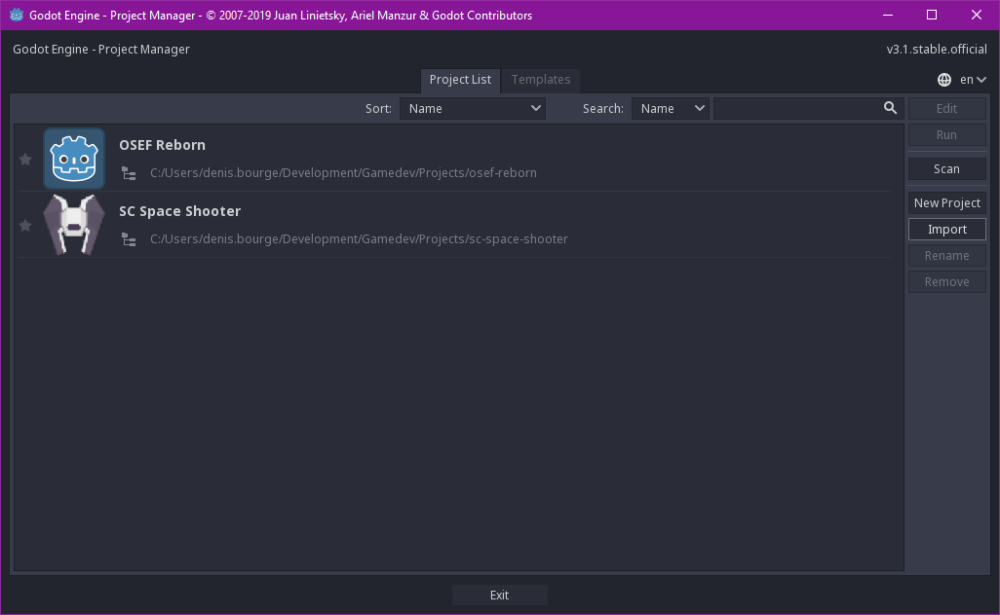
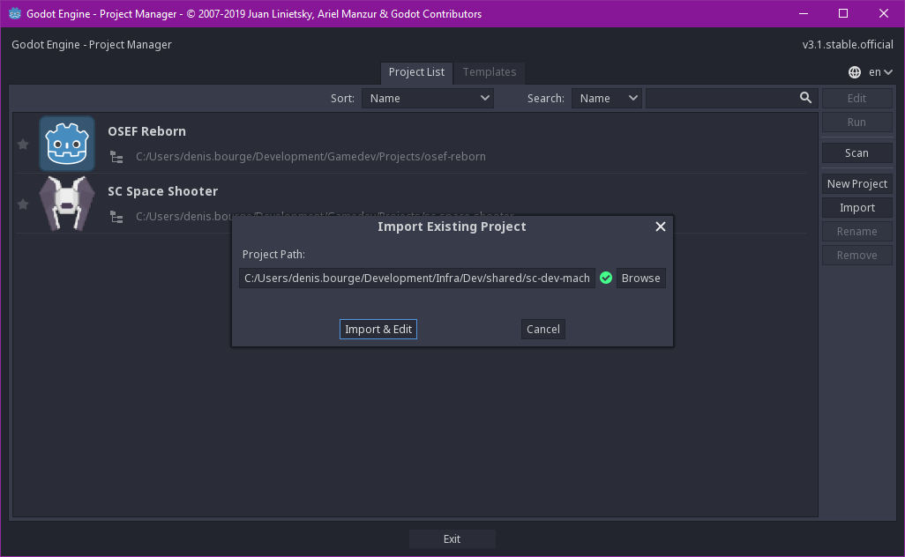
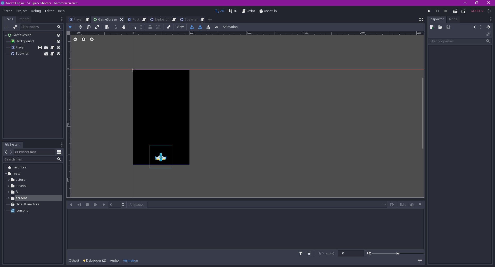
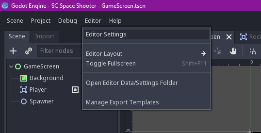
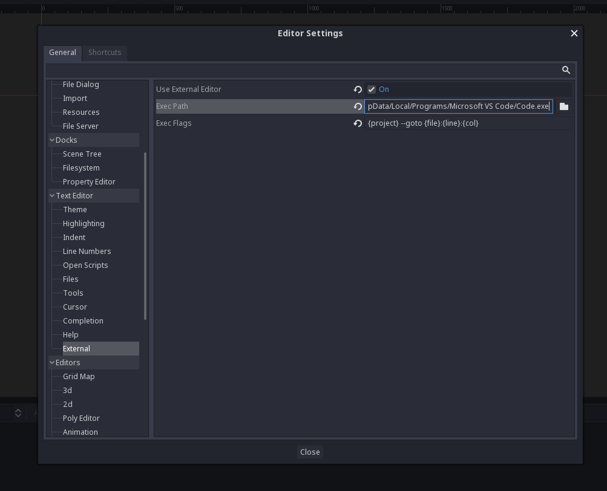
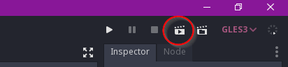
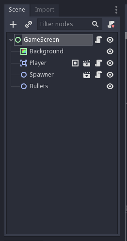

# Pratique - Prise en main de Godot

## Ouverture du projet

On va commencer par ouvrir Godot puis charger le projet d'exemple dans `./sc-space-shooter-pack`.

Il faut appuyer sur le bouton **"Import"**.

  

Et appuyer sur **"Importer"** après avoir sélectionné le chemin vers le projet.

  

Normalement, vous devriez voir l'interface de Godot.

  

## Configuration de l'éditeur

Avant de commencer à jouer avec Godot, on va configurer l'intégration avec Visual Studio Code.

Il faut d'abord ouvrir les paramètres de l'éditeur.

  

Puis aller dans la section **"Text Editor / External"**.  
Ici, il faudra:

- cocher la case **Use External Editor**
- mettre le chemin vers VSCode dans **Exec Path**
  - exemple: `C:/Users/Moi/AppData/Local/Programs/Microsoft VS Code/Code.exe`
- mettre `{project} --goto {file}:{line}:{col}` dans **Exec Flags**

  

Et voilà, VS Code est intégré à Godot.

## Et si on jouait avec le projet ?

Pour tester la scène courante (`GameScreen`), appuyez sur le clap en haut à droite.

  

Pour déplacer le vaisseau, utilisez les **touches fléchées** et la touche **ESPACE (ou ENTREE)** pour tirer.
Fermez la fenêtre quand vous en avez marre.

## Bon alors, a quoi ça ressemble tout ça dans Godot ?

Godot repose sur un principe de scenes (scènes) et de nodes (noeuds).

Prenez la scène actuellement ouverte, `GameScreen`, et regardez la "tree view" en haut à gauche.

  

Ici, on voit qu'il y a en tout 5 nodes dans cette scène, avec un noeud racine de type `Control` appelé `GameScreen`.
Chaque scène possède un noeud racine comme celui-ci.
Voici les nodes qui composent cette scène:

- Background (type `ColorRect`)
  - Définit une couleur à appliquer sur la scène, ici du noir.
- Player (type `Player` (custom))
  - Représente le joueur via une autre scène du projet.
- Spawner (type `Spawner` (custom))
  - Système de spawner qui peut faire apparaître n'importe quel type d'objet. C'est une autre scène du projet.
- Bullets (type `Node2D`)
  - Un conteneur pour stocker les balles qui seront instanciées.

Il existe plusieurs types de nodes dans Godot, et il est possible de créer ses propres nodes en partant de nodes déja existants et en leur liant des scripts. On verra des exemples par la suite.
Si ça vous semble un peu confus, c'est normal, on va pratiquer.

On va commencer à changer des trucs et créer de nouveaux nodes dans la prochaine partie.
