# Des ennemis

Dans cette partie, on va faire un ennemi, prêt à être utilisé dans le jeu.

## Préparation

C'est parti, `Scene -> New Scene`, on part de `Custom Node`, on choisit un noeud `Area2D` et on enregistre sous `res://actors/Enemy.tscn`.  
On renomme le nouveau noeud en `Enemy` et on commence.

Alors tout d'abord, pourquoi `Area2D` ?  
C'est un node qui permet de gérer les collisions en se basant sur la position des objets, au lieu d'utiliser une simulation physique: c'est plus rapide.  
On aura besoin de ça pour détecter la collision avec les balles et le joueur.

On va avoir besoin des nodes suivants en enfant:

- Une image: donc d'un noeud **Sprite**
- Une forme pour gérer les collisions: **CollisionShape2D**
- Un système de particules: **Particles2D**
- Un système d'animation: **AnimationPlayer**

On va aussi instancier des scènes existantes (depuis les scènes du projet):

- Le système de balles: **actors/BulletSystem.tscn**
- Une explosion: **fx/Explosion.tscn**

<p style="text-align: center">
  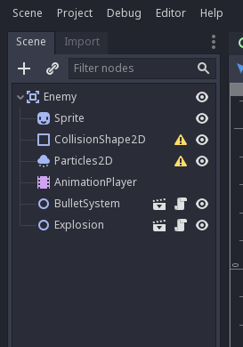
</p>

## Préparation de l'Area2D

On va commencer par paramétrer le node racine, qui est un Area2D, en appuyant dessus. Dans l'inspecteur, ouvrez la sous-section `Area2D -> Collision`.  
En laissant le curseur sur les premières cases, vous voyez le label attribué à chacune.

Une case correspond à un type d'objet, dans cette ordre là (que j'ai déja défini dans les paramètres du projet):

- Bit 0 (value 1): Player
- Bit 1 (value 2): Rock
- Bit 2 (value 4): Enemy
- Bit 3 (value 8): Bullet

Voici ce qu'il faut faire:

- Pour le champ Layer, ne cocher que la 3e case (correspondant à Enemy)
- Pour le champ Mask, ne cocher que la 1ere et 4e case (Player et Bullet)

Cela permet au système de détection de collisions de ne remonter que les collisions entre Enemy et Bullet, ou Enemy et Player (et non Enemy et Rock).

<p style="text-align: center">
  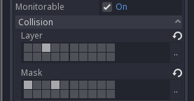
</p>

Ensuite, il faut aller dans la section `Node` en haut à droite, appuyer sur `Groups`, puis taper `Player` et appuyer sur `Add`, et hop, on a ajouté le groupe `Enemy` sur le noeud racine.

## Choix de l'image

On appuie sur le `Sprite` dans la treeview, on choisit une image dans les assets en bas à droite dans le dossier `res://assets/textures/Enemies/`, et on fait un glisser-déposer dans le champ `Sprite -> Texture` de l'inspecteur (on peut aussi appuyer sur le champ et faire `Load`).

<p style="text-align: center">
  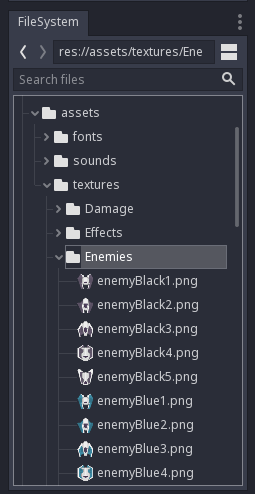
</p>

Si besoin, on peut choisir une "teinte" en changeant la couleur dans le champ `CanvasItem -> Visibility -> Modulate`.

On est bon pour l'image.

## Définition du shape de collision

On va maintenant spécifier la surface de contact de l'ennemi. Pour ça, on sélectionne le node `CollisionShape2D`, et on crée un nouveau `CircleShape2D` dans le champ `CollisionShape2D -> Shape` de l'inspecteur.

Il y a deux façons pour définir la taille du shape: avec l'inspecteur en sélectionnant le shape, ou dans la vue centrale en zoomant et en déplaçant le point orange. Le shape apparaît en bleu.  
Faites en sorte que le shape recouvre le sprite de l'ennemi.

<p style="text-align: center">
  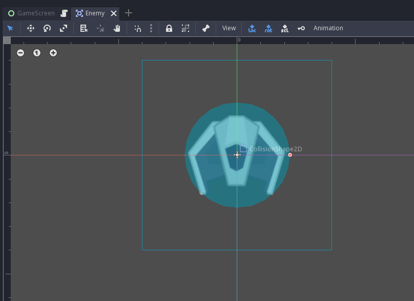
</p>

## Effet de particules

Je vais aller vite sur les particules, vous pouvez faire ce que vous voulez.  
Voici ce que j'ai fait:

Côté `Particles2D`:

- `Amount`: `30`
- `Time -> Lifetime`: `2`
- `Time -> Speed Scale`: `2`
- `Drawing -> Local Coords`: `Off`

Côté `ParticlesMaterial`:

- `Emission Shape -> Shape`: `Box`
- `Emission Shape -> Box Extents`: `(X: 30, Y: 30, Z: 1)`
- `Spread -> Spread`: `180`
- `Gravity -> Gravity`: `(X: 0, Y: 0, Z: 0)`
- `Initial Velocity -> Velocity`: `20`
- `Angular Velocity -> Velocity`: `100`
- `Angular Velocity -> Velocity Random`: `1`
- `Scale -> Scale`: `20`
- `Scale -> Scale Random`: `1`
- `Scale -> Scale Curve`: `New CurveTexture`
- `Scale -> Scale Curve -> Curve`: Déplacer le premier point vers le bas à 0
- `Color -> Color Ramp`: `New GradientTexture`
- `Color -> Color Ramp -> Gradient`: `New Gradient`
- `Color -> Color Ramp -> Gradient -> Gradient`: Cliquer sur le curseur à gauche, puis sur la couleur dans l'encart à droite, et choisir une couleur violette (ou la couleur que vous souhaitez).
- `Color -> Color Ramp -> Gradient -> Gradient`: Cliquer sur le curseur à droite, puis sur la couleur dans l'encart à droite, choisir une couleur noire et déplacer le curseur A (Alpha) à 0.

Côté `CanvasItem`:

- `Visibility -> Show Behind Parent`: `On`

Ca devrait donner quelque chose comme ça:

<p style="text-align: center">
  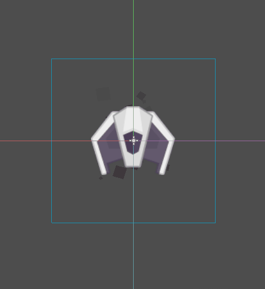
</p>

## Configuration du BulletSystem

Côté `BulletSystem`, il faut:

- activer le `Enemy Mode`,
- définir le `Fire Delay` à `1`,
- et déplacer le noeud en dessous le vaisseau dans la vue centrale, pour que les lasers ne sortent pas du milieu du vaisseau.

## Animations

On va maintenant jouer avec le système d'animations, lors de l'impact d'un laser sur le vaisseau (`hit`), et lors de l'explosion (`explode`).  
Il faut également définir une animation où il ne se passe rien au cas où on voudrait réinitialiser certains paramètres (`idle`).

Il faut sélectionner le node `AnimationPlayer` dans la tree-view, et regarder le panel du bas, section `Animation`.

<p style="text-align: center">
  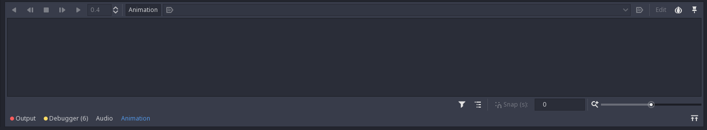
</p>

Pour créer une animation, il faut appuyer sur le bouton `Animation -> New`, puis taper le nom de l'animation. Commencez par créer `idle`, et définissez la en tant qu'animation par défaut (en autoplay).

<p style="text-align: center">
  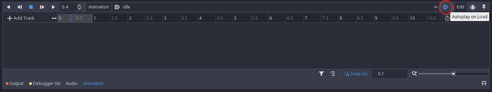
</p>

Ensuite, on recrée une animation appelée `hit`, et on va commencer à animer.

Il faut savoir qu'avec Godot, la plupart des propriétés exposées dans l'inspecteur peuvent être animées. Pour cette animation, on va seulement changer la teinte du sprite de l'ennemi (soit `Sprite -> CanvasItem -> Visibility -> Modulate`).
Pour ajouter une **track** à l'animation, pendant que le panel d'animation est ouvert, appuyez sur la clé sur le côté de la propriété à animer. Ici, il faut ajouter `Modulate`, puis appuyer sur `Create` lorsque la popup apparaît.

<p style="text-align: center">
  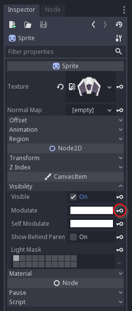
</p>

Pour faire un effet de couleur, on met le curseur sur `0.1` seconde, puis on change la couleur de la propriété `Modulate` pour mettre du *rouge vif*, et on appuie sur la clé à côté.  
Ensuite, on met le curseur sur `0.4` seconde, puis on remet la couleur en *blanc*, et on appuie sur la clé.  
Enfin, on change la durée de l'animation (en dessous du bouton `Edit` sur la droite du panel `Animation`) pour mettre `0.4`.

<p style="text-align: center">
  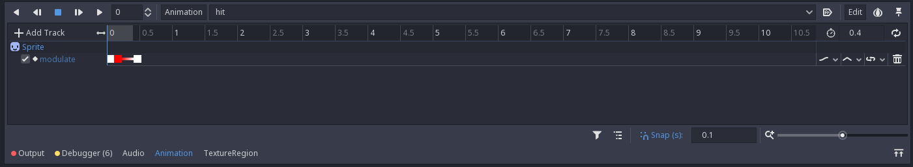
</p>

Vous pouvez appuyer sur les boutons Play/Stop du panel d'animation pour avoir un aperçu de l'animation.

On continue en créant une nouvelle animation, appelée `explode`.

Tout comme pour `hit`, on va juste animer la propriété `Modulate`, pour simuler la "disparition" progressive de l'image.

Donc en s'assurant que le curseur est sur la position `0.0`, on appuie sur la clé à côté de `Modulate` avec la couleur `blanche`, puis on déplace le curseur sur `0.2`, on change la valeur de `Modulate` avec la couleur alpha à 0 pour rendre l'image transparente, et on ré-appuie sur la clé.

Enfin, on change la durée de l'animation à `0.2` seconde.

<p style="text-align: center">
  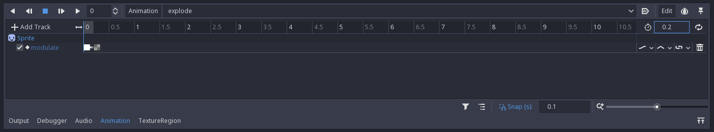
</p>

## Scripting: début

On va enfin commencer à coder ! (eh oui Coding Dojo).  
Sélectionnez le node racine `Enemy`, et appuyez sur le bouton avec un genre de parchemin dessus.

<p style="text-align: center">
  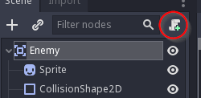
</p>

Une popup devrait ensuite s'afficher sur les options de configuration du script, faites juste `Create` et *magie*, VSCode se réveille, avec ce contenu:

```py
extends Area2D

# Declare member variables here. Examples:
# var a = 2
# var b = "text"

# Called when the node enters the scene tree for the first time.
func _ready():
    pass # Replace with function body.

# Called every frame. 'delta' is the elapsed time since the previous frame.
#func _process(delta):
#    pass
```

Ceci est du GDScript. Prenez le temps de lire les commentaires.

On va enlever tout ce code et remplacer par ça:

```py
extends Area2D

#######
# Enemy

signal exploded

# Max enemy speed
export (Vector2) var max_speed = Vector2(150, 75)
# Max hit points
export (int) var hit_points = 3

# Current velocity
var velocity = Vector2()
# Remaining hit points
var remaining_hit_points = 0
# Current accumulator
var accu = 0

onready var sprite = $Sprite
onready var explosion = $Explosion
onready var bullet_system = $BulletSystem
onready var animation_player = $AnimationPlayer
onready var particles = $Particles2D
onready var collision_shape = $CollisionShape2D

###################
# Lifecycle methods

func _ready():
    """When node is ready in game tree."""
    self.connect("area_entered", self, "_on_area_entered")

    self.velocity.y = self.max_speed.y
    self.remaining_hit_points = self.hit_points

func _process(delta):
    """Process each step."""
    self.accu += delta
    self.velocity.x = sin(self.accu) * self.max_speed.x
    self.bullet_system.firing = true

    self.position += self.velocity * delta

    if self.accu >= 2 * PI:
        self.accu -= 2 * PI

    self._wrap_position()

################
# Public methods

func hit():
    """Hit the enemy."""
    if self.remaining_hit_points <= 0:
        return

    self.animation_player.play("hit")
    self.remaining_hit_points -= 1
    if self.remaining_hit_points <= 0:
        self.explode()

func explode():
    """Make it explode."""
    # Reset velocity
    self.velocity = Vector2()
    self.collision_shape.set_deferred("disabled", true)
    self.emit_signal("exploded")

    self.particles.emitting = false
    self.animation_player.play("explode")
    self.explosion.play()
    yield(get_tree().create_timer(0.5), "timeout")
    self.queue_free()

func prepare_for_spawn(spawner, x, y):
    """Prepare for spawn (Spawner method)."""
    self.position.x = x
    self.position.y = y

#################
# Private methods

func _wrap_position():
    """Wrap position on screen."""
    var game_size = self.get_viewport().size
    var sprite_size = self.sprite.texture.get_size() * self.scale

    var x_lower_limit = -sprite_size.x / 2
    var x_upper_limit = game_size.x + sprite_size.x / 2
    var y_lower_limit = game_size.y + sprite_size.y / 2

    if self.position.x < x_lower_limit:
        self.position.x = x_upper_limit
    elif self.position.x > x_upper_limit:
        self.position.x = x_lower_limit

    if self.position.y > y_lower_limit:
        self.queue_free()

#################
# Event callbacks

func _on_area_entered(area):
    """When colliding with another area."""
    if area.is_in_group("Bullet") and !area.enemy_mode:
        area.queue_free()
        self.hit()

```

Oui, ça fait pas mal, et y'a beaucoup de choses à expliquer, mais ce bout de script va donner vie à l'ennemi à l'écran. Avant d'expliquer le script, on va le voir à l'oeuvre.

## Intégration des ennemis

Retournez sur le `GameScreen`.

On va ajouter un node de type `Spawner` pour faire apparaître des ennemis sur la scène.  
Clique droit sur le `GameScreen`, `Instance Child Scene`, et ajoutez `Spawner`. Renommez le `EnemySpawner`.  
Dans l'inspecteur, changez `Spawn Delay` à `5`, et dans la valeur `Scene`, chargez la scène `Enemy` qu'on a crée dans cette partie.

On va devoir un peu modifier le script de `GameScreen` d'abord:

- Sous la ligne `onready var rock_spawner = $RockSpawner`: ajouter la ligne:

```py
onready var rock_spawner = $RockSpawner
```

- Dans la fonction `_ready`: ajouter la ligne:

```py
self.enemy_spawner.connect("spawn", self, "_on_enemy_spawn")
```

- Sous la fonction `_on_rock_spawn`: ajouter la fonction:

```py
func _on_enemy_spawn(spawner, element):
    element.connect("exploded", self, "_on_enemy_exploded")
    element.bullet_system.connect("fire", self, "_on_fire")
```

- Puis sous `_on_rock_exploded`: ajouter la fonction:

```py
func _on_enemy_exploded():
    self._add_score(500)
```

Faites `Play Scene`, et normalement, les ennemis devrait apparaître comme par magie toutes les 5 secondes et vous tirer dessus.

<p style="text-align: center">
  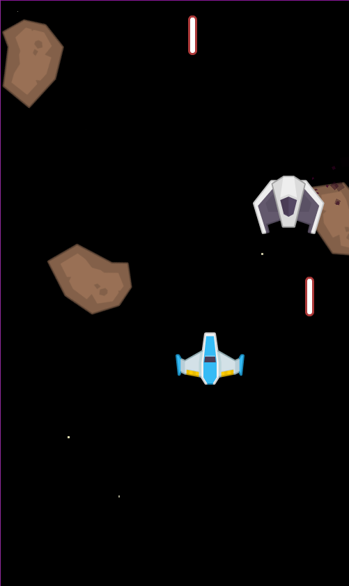
</p>

## Scripting: le retour

On va maintenant rentrer dans le détail du script.

```py
extends Area2D

#######
# Enemy

signal exploded

# Max enemy speed
export (Vector2) var max_speed = Vector2(150, 75)
# Max hit points
export (int) var hit_points = 3

# Current velocity
var velocity = Vector2()
# Remaining hit points
var remaining_hit_points = 0
# Current accumulator
var accu = 0

onready var sprite = $Sprite
onready var explosion = $Explosion
onready var bullet_system = $BulletSystem
onready var animation_player = $AnimationPlayer
onready var particles = $Particles2D
onready var collision_shape = $CollisionShape2D

...
```

Sur cette première partie de script, on voit:

- Un signal `exploded`, émit quand l'ennemi explose,
- Des variables exportés: celles-ci apparaissent dans l'inspecteur:
  - `max_speed`: La vitesse max d'un ennemi, c'est un Vector2, un objet avec une coordonnée X et Y,
  - `hit_points`: Le nombre de tirs qu'un ennemi peut recevoir avant d'exploser, un entier.
- Des variables non-exportées: celles-ci n'apparaissent pas dans l'inspecteur:
  - `velocity`: La vélocité actuelle de l'ennemi, Vector2,
  - `remaining_hit_points`: Nombre de tirs restants, entier,
  - `accu`: Variable utilisée pour le mouvement des ennemis, entier.
- Des références vers des enfants du node courant: via la fonction `$`, on peut récupérer un noeud depuis le noeud courant en tapant son chemin, ici seulement son nom. `onready` veut dire que la variable sera automatiquement chargée lorsque le noeud sera intégré dans le game tree.
  - `sprite`: Le sprite de l'ennemi,
  - `explosion`: Une explosion,
  - `bullet_system`: Le système qui s'occupe de la gestion des tirs,
  - `animation_player`: Le système d'animation,
  - `particles`: Le système de particules,
  - `collision_shape`: Le shape de collision de l'ennemi.

*Suivant,*

```py
...

###################
# Lifecycle methods

func _ready():
    """When node is ready in game tree."""
    self.connect("area_entered", self, "_on_area_entered")

    self.velocity.y = self.max_speed.y
    self.remaining_hit_points = self.hit_points

func _process(delta):
    """Process each step."""
    self.accu += delta
    self.velocity.x = sin(self.accu) * self.max_speed.x
    self.bullet_system.firing = true

    self.position += self.velocity * delta

    if self.accu >= 2 * PI:
        self.accu -= 2 * PI

    self._wrap_position()
    
...
```

Ces deux fonctions sont des méthodes dites de *lifecycle*, du *cycle de vie* de la scène:

- `_ready`: Appelée lorsque le noeud est intégré dans le game tree, c'est ici qu'on fait les initialisations.
  - Ici, on connecte le signal `area_entered` exposé par le noeud courant (`Area2D`) sur une fonction appelée `on_area_entered`,
  - On définit la vélocité Y courante avec la valeur max,
  - Et on définit les points de vie restants avec la valeur de base.
- `_process`: Appelée à chaque step de l'exécution de la scène. Dans une exécution à 60 FPS, elle est exécutée toutes les 16 ms. C'est ici qu'on fait les mises à jour des éléments de la scène. La variable `delta` contient le délai qui s'est écoulé depuis la dernière update.
  - Ici, on augmente la valeur de l'accumulateur,
  - On change la vélocité X suivant une sinusoïde pour donner un effet sympa,
  - On active le système de tir,
  - On définit la position de l'ennemi depuis sa vélocité,
  - On "boucle" la valeur de l'accumulateur pour éviter de partir dans l'infini,
  - On "wrap" la position de l'ennemi sur l'écran (fonction définie plus loin).

Vous vous demandez peut être à quoi sert ce `delta` et pourquoi `_update` est appelée aussi souvent.
Je vais pas rentrer trop dans le détail, des articles entiers ont été réalisés sur la gestion du "time step" dans le jeu vidéo, mais il faut savoir qu'il est nécessaire de "découper" l'exécution de cette façon pour que tout puisse se mettre à jour et s'afficher en même temps.

*Suivant,*

```py
################
# Public methods

func hit():
    """Hit the enemy."""
    if self.remaining_hit_points <= 0:
        return

    self.animation_player.play("hit")
    self.remaining_hit_points -= 1
    if self.remaining_hit_points <= 0:
        self.explode()

func explode():
    """Make it explode."""
    # Reset velocity
    self.velocity = Vector2()
    self.collision_shape.set_deferred("disabled", true)
    self.emit_signal("exploded")

    self.particles.emitting = false
    self.animation_player.play("explode")
    self.explosion.play()
    yield(get_tree().create_timer(0.5), "timeout")
    self.queue_free()

func prepare_for_spawn(spawner, x, y):
    """Prepare for spawn (Spawner method)."""
    self.position.x = x
    self.position.y = y
    
...
```

Ici, on définit 3 fonctions:

- `hit`: S'assure d'enlever un point de vie à l'ennemi:
  - D'abord, on quitte la fonction si on a plus de points (explode devrait déja avoir été appelé),
  - On exécute l'animation `hit`,
  - On enlève un point,
  - S'il n'y a plus de point: on appelle `explode`.
- `explode`: Fait exploser l'ennemi:
  - D'abord, on reset la vélocité (ça évite de faire glisser l'ennemi n'importe où pendant qu'il explose),
  - On désactive le shape de collision (ça évite de bloquer les tirs du joueur pendant l'explosion),
  - On émet le signal `exploded`,
  - On désactive le système de particules,
  - On exécute l'animation `explode`,
  - On lance l'explosion,
  - On attend 0.5 secondes (explication ci-dessous),
  - Et enfin on programme la suppression du noeud.
- `prepare_for_spawn`: Méthode nécessaire qui sera appelée depuis `Spawner`:
  - On définit juste la position depuis les valeurs envoyées depuis le spawner.

Petite explication sur le `yield` de `explode`: si à la place on avait fait quelque chose comme `sleep 0.5`, on aurait bloqué toute l'exécution du jeu. Hors ici on veut juste attendre avant d'appeler la méthode `queue_free` pour supprimer le node.

Ici, on crée un timer de 0.5 secondes à la volée via `get_tree().create_timer(0.5)`, et on attend le déclenchement du signal `timeout`, en redonnant la main au jeu (on met la fonction en "pause").
Quand le signal a été émis, la fonction `explode` reprend la main, et on exécute bien `queue_free`, et ce sans bloquer le jeu.

C'est le fonctionnement même des fameuses **coroutines**, qu'on peut trouver dans la plupart des langages, comme en Python par exemple.

*Suivant,*

```py
...

#################
# Private methods

func _wrap_position():
    """Wrap position on screen."""
    var game_size = self.get_viewport().size
    var sprite_size = self.sprite.texture.get_size() * self.scale

    var x_lower_limit = -sprite_size.x / 2
    var x_upper_limit = game_size.x + sprite_size.x / 2
    var y_lower_limit = game_size.y + sprite_size.y / 2

    if self.position.x < x_lower_limit:
        self.position.x = x_upper_limit
    elif self.position.x > x_upper_limit:
        self.position.x = x_lower_limit

    if self.position.y > y_lower_limit:
        self.queue_free()

#################
# Event callbacks

func _on_area_entered(area):
    """When colliding with another area."""
    if area.is_in_group("Bullet") and !area.enemy_mode:
        area.queue_free()
        self.hit()
```

C'est la fin du script, on définit ici deux méthodes:

- `_wrap_position`: Appelée dans le code de `_update`, permet de s'assurer que l'ennemi reste sur l'écran, et lorsqu'il traverse les bordures de l'écran lors de son déplacement, permet de le téléporter de l'autre coté:
  - On récupère la taille du jeu et du sprite,
  - On définit les limites min/max à atteindre,
  - Si on dépasse d'un côté on va de l'autre,
  - Si on dépasse du bas de l'écran, on détruit le node.
- `_on_area_entered`: On l'a branchée dans la méthode `_ready`, permet de réagir aux collisions avec le noeud courant. Le paramètre `area` contient le noeud cible avec lequel l'ennemi a eu une collision.
  - Ici, on regarde si le noeud cible est dans le groupe `Bullet` et qu'il n'est pas en mode "ennemi".
  - Si c'est le cas, c'est que c'est un tir du joueur, donc on supprime la balle (via `queue_free`, et on appelle `hit` sur l'ennemi)
  
Voilà, vous avez toutes les explications sur l'ennemi, ça fait beaucoup mais c'est pas vraiment compliqué finalement, et ça permet de faire pas mal de choses.
