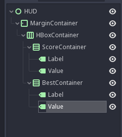
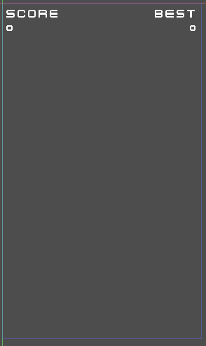
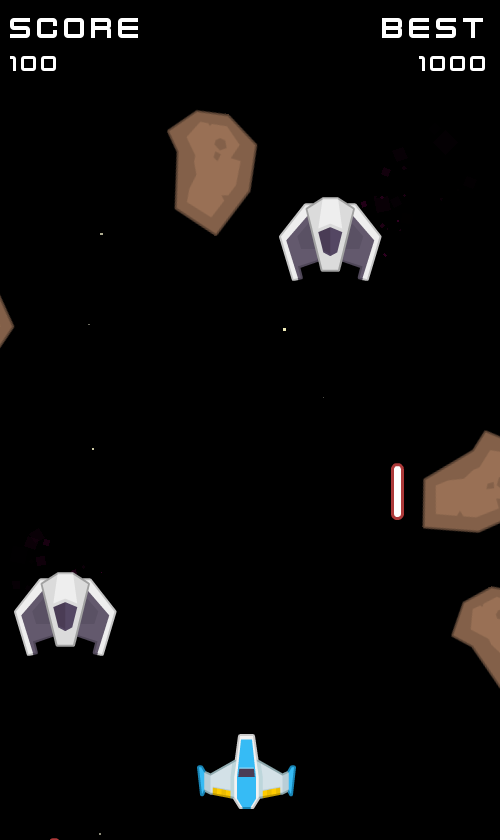

# Un HUD pour le score

Plus simple que la partie précédente, on va mettre en place un petit HUD pour montrer le score actuel.

## Préparation

On va faire une nouvelle scène (`Scene -> New Scene`) et on part de `User Interface`, on renomme le noeud en `HUD` et on enregistre sous `res://ui/HUD.tscn`.

On a donc un noeud de type `Control`, qui permet de réaliser de l'UI.

On va aller vite: on va enchaîner les créations de noeud.
On va avoir besoin de cette arbre là sous le noeud `HUD`:

- Créer un `MarginContainer`,
  - Il faut définir son `Layout` à `Full Rect`,
  - Et changer les `Custom Constants` en mettant `20` partout, pour avoir un petit margin,
  - Ajouter un enfant `HBoxContainer`,
    - Dans `Size Flags`, décocher `Vertical -> Fill`,
    - Ajouter un enfant `VBoxContainer` (*à renommer* `ScoreContainer`),
      - Dans `Size Flags`, cocher `Horizontal -> Expand` (en plus de `Fill`),
      - Ajouter un enfant `Label`,
        - Taper `SCORE` dans `Text`,
        - Définir une `Font` dans `Custom Fonts` en choisissant `New Dynamic Font`
          - Puis dans `Font` charger `res://assets/fonts/kenvector_future.ttf`,
          - Et changer `Settings -> Size` à `32`,
      - Ajouter un enfant `Label` (*à renommer* `Score`),
        - Taper `0` dans `Text`,
        - Définir une `Font` dans `Custom Fonts` en choisissant `New Dynamic Font`
          - Puis dans `Font` charger `res://assets/fonts/kenvector_future.ttf`,
          - Et changer `Settings -> Size` à `24`,
    - Ajouter un enfant `VBoxContainer` (*à renommer* `BestContainer`),
      - Dans `Size Flags`, cocher `Horizontal -> Expand` (en plus de `Fill`),
      - Ajouter un enfant `Label`,
        - Taper `BEST` dans `Text`,
        - Changer `Align` pour `Right`,
        - Définir une `Font` dans `Custom Fonts` en choisissant `New Dynamic Font`
          - Puis dans `Font` charger `res://assets/fonts/kenvector_future.ttf`,
          - Et changer `Settings -> Size` à `32`,
      - Ajouter un enfant `Label` (*à renommer* `Score`),
        - Taper `0` dans `Text`,
        - Changer `Align` pour `Right`,
        - Définir une `Font` dans `Custom Fonts` en choisissant `New Dynamic Font`
          - Puis dans `Font` charger `res://assets/fonts/kenvector_future.ttf`,
          - Et changer `Settings -> Size` à `24`,

Une fois que c'est fait, on devrait avoir ça:

<p style="text-align: center; vertical-align: center;">
  
</p>

<p style="text-align: center">
  
</p>

## Intégration dans le jeu

Dans la scène `GameScreen`, ajoutez un noeud de type `CanvasLayer` tout en bas de l'arbre, puis ajoutez la scène `HUD` en enfant.

Il faut maintenant brancher le HUD dans le script de `GameScreen`.

- Il faut ajouter deux références vers les labels du HUD sous les lignes `onready`:

```py
onready var hud_score = $CanvasLayer/HUD/MarginContainer/HBoxContainer/ScoreContainer/Value
onready var hud_best = $CanvasLayer/HUD/MarginContainer/HBoxContainer/BestContainer/Value
```

- Définir une fonction `_update_hud` sous `_add_score`:

```py
func _update_hud():
    self.hud_score.text = str(self.score)
    self.hud_best.text = str(self.best_score)
```

- Mettre à jour `_add_score` et ajouter à la fin:

```py
self._update_hud()
```

- Puis mettre à jour `_on_player_dead` pour ajouter à la fin:

```py
self._update_hud()
```

Faites `Play Scene`, et hop, le HUD devrait fonctionner.

<p style="text-align: center">
  
</p>
