# Un fond avec des étoiles

## Préparation

Avec juste un fond noir ça fait pas vraiment espace, il manque un truc: des étoiles.  
Donc on va faire en sorte d'illuminer un peu tout ça, via une petite arnaque: on va utiliser un **système de particules**.

Avec un système de particules, on peut faire n'importe quoi:

- De la pluie,
- De la neige,
- Du feu,
- Une explosion,
- De la fumée,
- Ou bien encore des étoiles !

Faut pas avoir peur, un système de particules c'est assez simple finalement, ça a juste beaucoup d'options, ce qui fait qu'on peut faire ce qu'on veut.

Alors on va tout de suite créer notre première scène. Appuyez sur **File / New Scene**.

  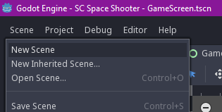

Un nouvel onglet est apparu, et sur la gauche vous avez le choix pour le node racine.  
Parmi les nodes proposés, il y a:

- 2D Scene: Va choisir un node de type `Node2D` en racine.
- 3D Scene: Va choisir un node de type `Node` en racine.
- User Interface: Va choisir un node de type `Control` en racine.
- Custom Node: Va vous permettre de sélectionner un autre node.

  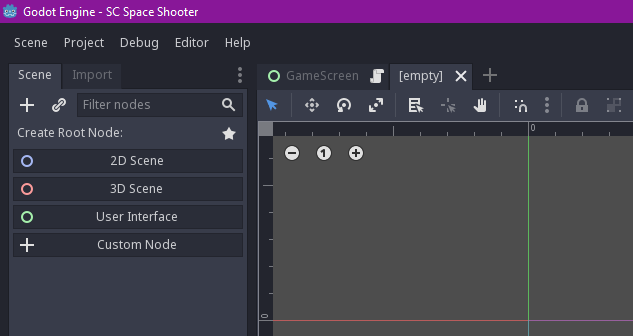

Partez sur un node `Control`, et enregistrez la scène dans le dossier `res://fx/` sous le nom `Stars.tscn`.  
Renommez le node `Control` en `Stars`.
Puis changez le `Layout` du noeud pour le passer en `Full Rect`.

  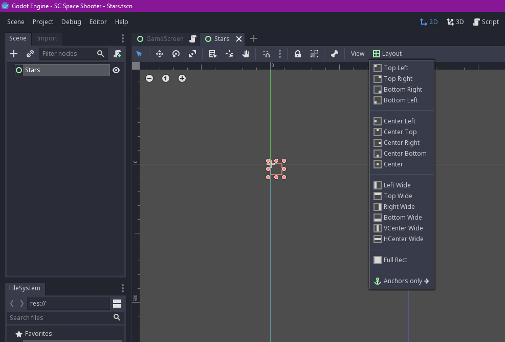

Le node va maintenant prendre toute la surface de l'app.  
On va créer un node de type `ColorRect` (en noir) qui va prendre toute la place du parent pour répliquer un semblant d'espace.

Il faut faire un clique droit sur le node `Stars` puis `Add Child Node`.

  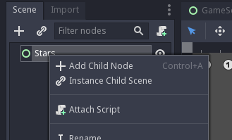

Vous avez toute une série de nodes à disposition.  
Cherchez `ColorRect` puis appuyez sur `Create`.  

  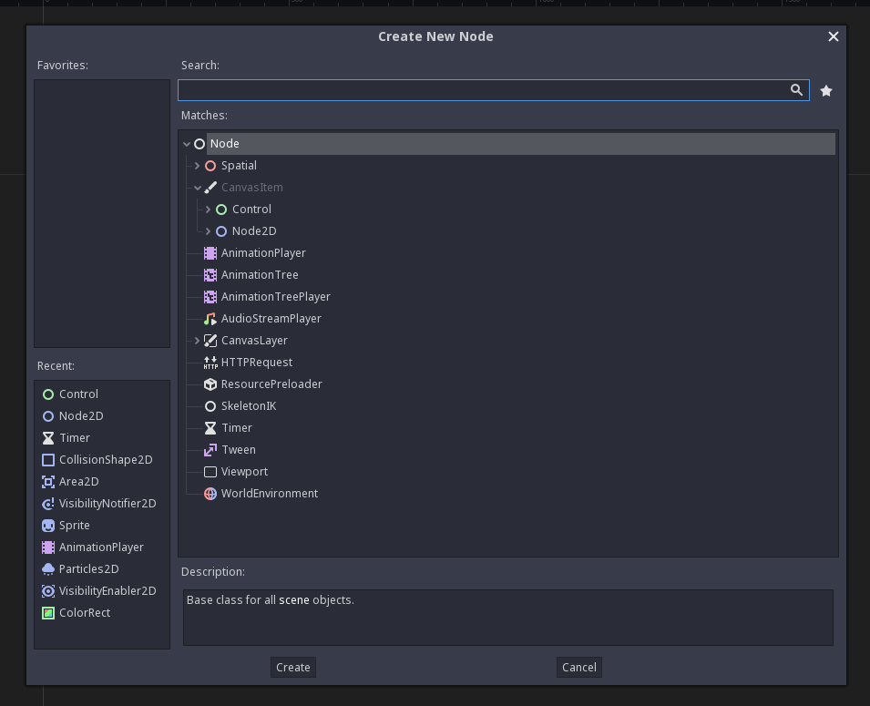

Recommencez l'opération avec le clique droit sur `Stars`, `Add Child Node` puis cherchez `Particles2D`.  
Vous devriez avoir cet arbre de nodes:

  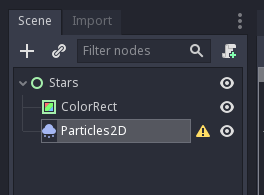

## Un fond

On va commencer par s'occuper du `ColorRect`. Cliquez dessus et regardez sur la droite.

  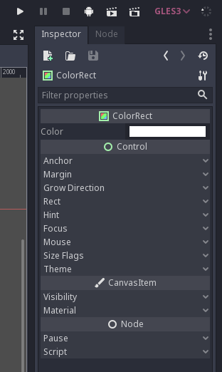

Godot se repose sur des concepts d'héritages, reprenant les principes de la POO. Ici, on voit 4 sections:

- ColorRect
- Control
- CanvasItem
- Node

On voit en fait ici l'héritage des noeuds. `ColorRect` hérite de `Control`, qui hérite de `CanvasItem`, qui hérite de `Node`.  
On peut depuis l'inspecteur changer chaque propriété exposée dans chacun de ces nodes.  
Ce qui nous intéresse ici, c'est le champ `Color` de `ColorRect`. Cliquez dessus et changez la couleur pour mettre du noir.

Le petit carré devrait devenir noir dans la vue principale au centre. On va le faire grandir pour qu'il prenne toute la place du parent, de la même façon que tout à l'heure: `Layout` > `Full Rect`.

  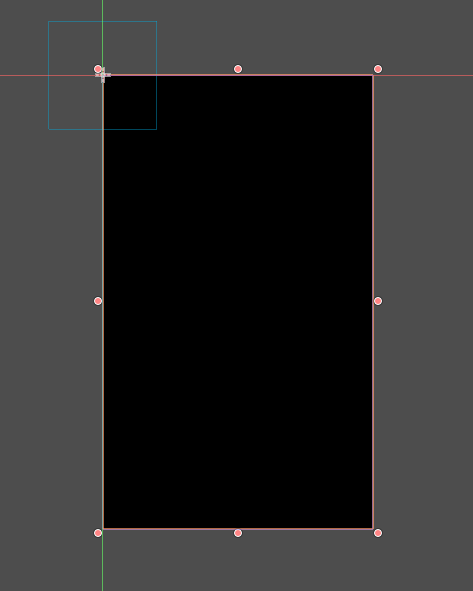

On vient de répliquer le node `Background` de la scène `GameScreen` de tout à l'heure: on a un fond noir.

## Des étoiles

On va se concentrer sur les particules maintenant.

Cliquez sur le node `Particles2D`, qui a un petit warning à coté: si vous survolez, il vous dit qu'il y a pas de **material** pour gérer les particules.

Avec Godot, il y a deux types de **material** pour les particules:

- ShaderMaterial: Utilisation d'un **shader**. Ca parle peut être à certains, le monde des shaders est un sujet hyper complexe, on ne va pas attaquer ça aujourd'hui.
- ParticlesMaterial: Utilisation d'un **material** configurable depuis l'inspecteur, ce qu'on va choisir.

Pour lier un **material**, il faut aller dans l'inspecteur à droite, puis choisir un `New ParticlesMaterial` dans la section `Particles2D` > `Process Material` > `Material`.  

  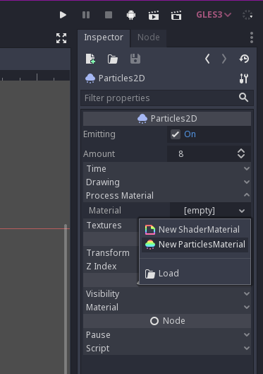

Pour le configurer, il faut ensuite cliquer sur ce material, et les paramètres vont apparaître en dessous. C'est ici que tout va se passer.

On va commencer par déplacer le node sur la vue du centre pour le mettre au centre de la scène, soit en drag & drop, soit en changeant la valeur dans `Node2D` > `Transform` > `Position`.
Si vous zoomez sur l'interface, vous voyez que le système de particules est actif, et que des particules sont bien générées.

  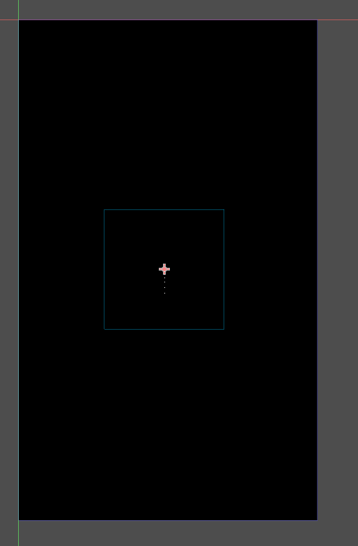

D'ici, vous pouvez configurer le système de particules comme vous le voulez, jouer avec la couleur, la taille, la texture, la vitesse, la gravité, et plein d'autres paramètres.

Pour avoir un truc qui ressemble à un ensemble d'étoiles voici ce que je recommande:

- `Emission Shape` > `Shape`: Choisir `Box`
- `Emission Shape` > `Box Extents`: Choisir `(X: 250, Y: 425, Z: 1)`
- `Gravity` > Choisir `(X: 0, Y: 0, Z: 0)`

Ca ressemble déja un peu à des étoiles.

- `Scale` > `Scale`: Choisir `4`
- `Scale` > `Scane Random`: Choisir `1`
- `Scale` > `Scale Curve`: Choisir `New CurveTexture`
- `Scale` > `Scale Curve` > `Curve`: Déplacer le dernier point vers le bas à 0

Maintenant on va jouer avec la couleur.

- `Color` > `Color Ramp`: Choisir `New GradientTexture`
- `Color` > `Color Ramp` > `Gradient`: Choisir `New Gradient`
- `Color` > `Color Ramp` > `Gradient` > `Gradient`: Cliquer sur le curseur à gauche, puis sur la couleur dans l'encart à droite, et choisir une couleur blanche (ou la couleur que vous souhaitez).
- `Color` > `Color Ramp` > `Gradient` > `Gradient`: Cliquer sur le curseur à droite, puis sur la couleur dans l'encart à droite, et déplacer le curseur A (Alpha) à 0.

Voilà, on a un effet "fade-out".

  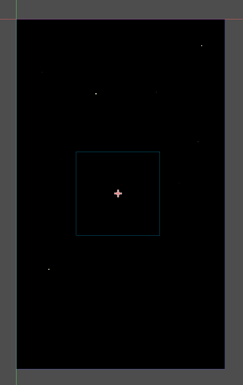

Tada, des étoiles !

Oubliez pas d'enregistrer la scène, on va pouvoir l'intégrer au `GameScreen`.

## Intégration

Retournez sur le `GameScreen`, supprimez le node `Background` via un clique-droit et `Delete Node`.  
Ensuite, clique-droit sur le `GameScreen` puis `Instance Child Scene`, et ajoutez votre scène `Stars`.  
Si ce n'est pas le cas, déplacez le nouveau noeud `Stars` vers le haut de l'arbre, en premier sous `GameScreen`, et renommez le en `Background`.  

Faites `Play Scene`, et voilà, les étoiles en action !
