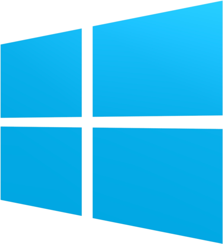

# Pré-requis

Avant de commencer notre session, vous aurez besoin de:

  
- Windows: même si ce moteur qu'on va utiliser est compatible Linux et Mac, on va se concentrer sur Windows aujourd'hui.

- [Visual Studio Code](https://code.visualstudio.com/): normalement tout le monde sait déja ce que c'est, et tout le monde devrait l'avoir d'installé.
  - Disponible ici: [https://code.visualstudio.com/](https://code.visualstudio.com/)

- [Godot Engine 3.1.1](https://godotengine.org/): le moteur de jeu open-source que je vais vous présenter aujourd'hui.
  - Disponible ici [https://godotengine.org/download/windows](https://godotengine.org/download/windows)

Même si Godot contient un éditeur intégré, je conseille quand même Visual Studio Code parce qu'il est quand même plus pratique et plus riche en fonctionnalités.
