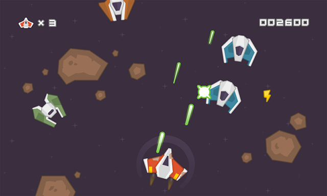

# Théorie - Godot Engine

  

## Présentation de Godot Engine

Godot Engine est un moteur complètement open-source, assez jeune dans le monde du gamedev, mais super prometteur.

Je ne vais pas récapituler toutes les features ici, vous pouvez directement aller sur leur [site officiel](https://godotengine.org/).

> Godot Engine is a feature-packed, cross-platform game engine to create 2D and 3D games from a unified interface. It provides a comprehensive set of common tools, so users can focus on making games without having to reinvent the wheel. Games can be exported in one click to a number of platforms, including the major desktop platforms (Linux, macOS, Windows) as well as mobile (Android, iOS) and web-based (HTML5) platforms.  
>
> Godot is completely free and open source under the permissive MIT license. No strings attached, no royalties, nothing. Users’ games are theirs, down to the last line of engine code. Godot’s development is fully independent and community-driven, empowering users to help shape their engine to match their expectations. It is supported by the Software Freedom Conservancy not-for-profit.

> Create games with ease using Godot's unique approach to game development.
>
> - **Nodes for all your needs**. Godot comes with hundreds of built-in nodes that make game design a breeze. You can also create your own for custom behaviors, editors and much more.
> - **Flexible scene system**. Create node compositions with support for instancing and inheritance.
> - **Visual editor** with all the tools you need packed into a beautiful and uncluttered context-sensitive UI.
> - **Friendly content creation pipeline** for artists, level designers, animators and everyone in between.
> - **Persistent live editing** where changes are not lost after stopping the game. It even works on mobile devices!
> - **Create your own custom tools** with ease using the incredible tool system.

  
   
  <i>Voici l'éditeur de Godot</i>

Pour la partie scripting, Godot permet de développer dans plusieurs langages de programmation:

- **GDScript** (principalement utilisé): un langage fait maison, qui reprend énormément de principes à Python. Permet d'écrire peu de code pour faire beaucoup.
- **C#** (via Mono): un langage qui a déja fait ses preuves (dans le monde du gamedev il est principalement utilisé dans Unity), mais son intégration dans Godot est encore un peu instable, sans support pour le mobile actuellement.
- **C++** (code natif): à l'ancienne, retour du mode warrior.
- **Rust, Python, et autres** (via GDNative): il est possible de faire du code natif dans d'autres langages si besoin, c'est cependant plus complexe à mettre en place.  

## Présentation du projet: un space shooter

On va entrer dans le vif du sujet: aujourd'hui on va faire un space shooter, on va donc faire le tour de ce qu'est un space shooter.

Oui c'est en effet un "jeu de tir dans l'espace", mais voici des caractéristiques plus spécifiques (et surtout utiles):

- On va faire un jeu **en 2D** (pour éviter de se cramer les ailes avant de partir),
- On va **diriger un vaisseau** qui **tire** sur **des rochers** et **des ennemis**,
- Le scrolling va être **vertical**, donc du haut vers le bas (plutot que horizontal),
- En gros voilà.

Pour cela, on va utiliser un pack de contenu déja fait pour réaliser notre space shooter, réalisé par Kenney, qui propose des super packs pour plusieurs types de jeux vidéos.

Voici le pack en question: [https://www.kenney.nl/assets/space-shooter-redux](https://www.kenney.nl/assets/space-shooter-redux), et un exemple de jeu réalisé juste avec ce pack:

  

On ne va peut être pas arriver à ce résultat en 2h (ou ce qu'il reste du temps imparti), mais si vous continuez chez vous, vous pouvez y arriver sans problème assez rapidement.
